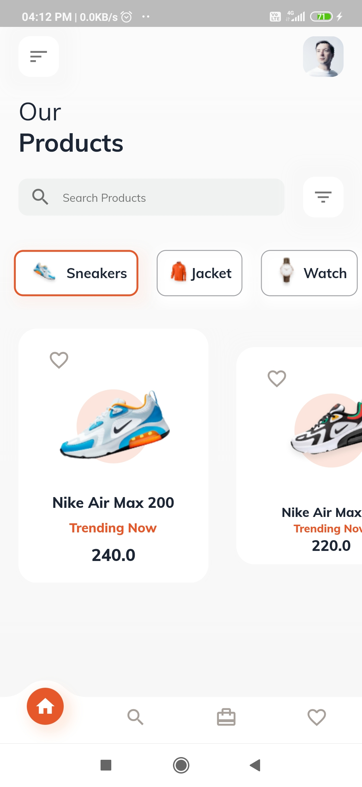
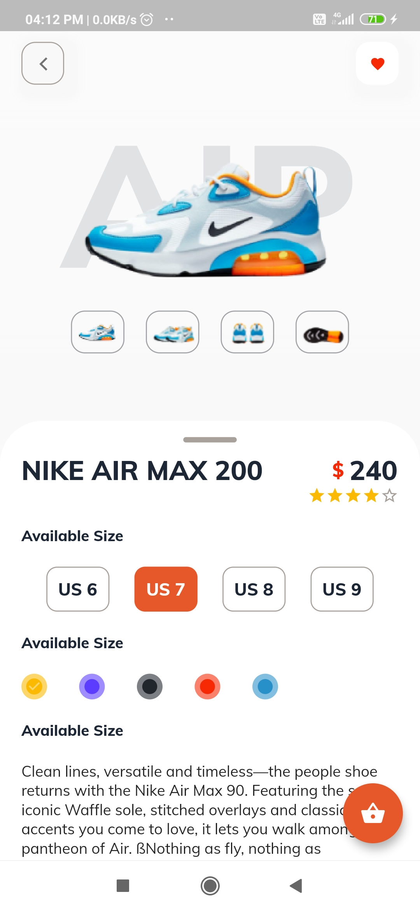
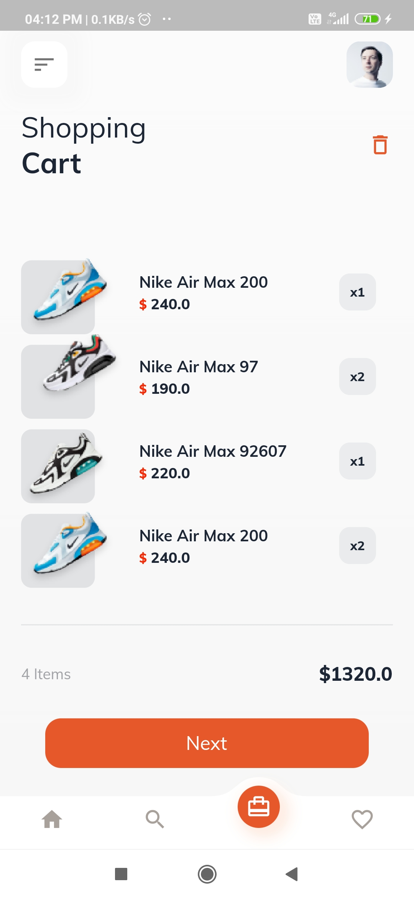

## flutter_ecommerce_app 

E-Commerce app is a design implementaion of [E-commerce App](https://dribbble.com/shots/10446127-E-commerce-App-Exploration/attachments/2283107?mode=media) designed by [Thekarthek](https://dribbble.com/Thekarthek)

## Download App 
<a href="https://github.com/Thekarthek/flutter_ecommerce_app/releases/download/v1.0.0/app-release.apk"></img></a>
 

## Android Screenshots

  HomePage                 |   Product Detail Page        |  Cart Page
:-------------------------:|:-------------------------:|:-------------------------:
||

## iOS Screenshots
  HomePage                 |   Product Detail Page        |  Cart Page
:-------------------------:|:-------------------------:|:-------------------------:
||

## Directory Structure
```
lib
│───main.dart    
└───src
    │───config
    |    └──route.dart
    │───model
    │    │──category.dart
    |    │──data.dart
    |    └──product.dart
    │───pages
    |    │──homePage.dart
    |    │──mainPage.dart
    |    │──product_detail.dart
    |    └──shoping_cart_page.dart
    │───theme
    |    │──light_color.dart
    |    └──theme.dart
    └───widgets
         │──BottomNavigationBar
         |   |──bootom_navigation_bar.dart
         |   |──bottom_curved_Painter.dart
         |   └──centered_elasticIn_curve.dart
         |──bottom_navigation_bar.dart
         |  customRoute.dart
         |  prduct_icon.dart
         │──product_card.dart
         └──title_text.dart
```
## 🚀 Features

* 🏠 Home Page with Product Listings
* 🔍 Product Detail Screen
* 🛒 Shopping Cart Page
* 🎨 Custom Bottom Navigation Bar
* 📱 Responsive UI
* 📦 Local Product Data Model
* 💡 Clean Folder Architecture

---

## 📸 Screenshots

| Home Screen                       | Product Detail                    | Shopping Cart                     |
| --------------------------------- | --------------------------------- | --------------------------------- |
|  |  |  |

---

## 🛠️ Tech Stack

* **Flutter**
* **Dart**
* Material UI Components
* Custom Widgets
* Navigator Routing

---

## 📂 Project Structure

```
lib/
 ├── main.dart
 ├── src/
 │    ├── config/
 │    ├── model/
 │    ├── pages/
 │    ├── themes/
 │    └── widgets/
```

---

## ⚙️ Getting Started

### 1️⃣ Clone the repository

```bash
git clone https://github.com/thekarthek/flutter_ecommerce_app.git
cd flutter_ecommerce_app
```

---

### 2️⃣ Install dependencies

```bash
flutter pub get
```

---

### 3️⃣ Run the app

```bash
flutter run
```

For web:

```bash
flutter run -d chrome
```

---

## 📦 Assets Used

* Product Images
* User Profile Image
* Custom Icons

(All assets are included inside the `/assets` folder)

---

## 🎯 Learning Outcomes

* Flutter UI design principles
* Widget composition
* Navigation & routing
* Custom painter usage
* Project folder structuring
* Git & GitHub workflow

---

## 👨‍💻 Author

**Bangaru Karthikreddy**
Flutter Developer | Software Engineer Aspirant

🔗 GitHub: [https://github.com/thekarthek](https://github.com/thekarthek)
🔗 LinkedIn: [https://www.linkedin.com/in/thekarthek](https://www.linkedin.com/in/thekarthek)

---
## Pull Requests

I welcome and encourage all pull requests. It usually will take me within 24-48 hours to respond to any issue or request.

## Created & Maintained By
TheKarthek : GitHub : https://github.com/thekarthek
LinkedIn : https://www.linkedin.com/in/thekarthek


> If you found this project helpful or you learned something from the source code and want to thank me, consider buying me a cup of :coffee:
>
> * [PayPal](https://www.paypal.me/Thekarthek/)

> You can also nominate me for Github Star developer program
> https://stars.github.com/nominate

## Visitors Count


